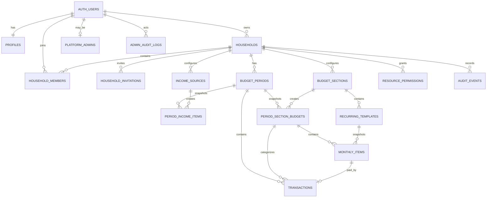

# Dabber ERD

## Notes

- `auth.users` is owned by Supabase Auth and is not recreated in the public schema.
- `resource_permissions` uses a polymorphic `resource_type/resource_id` pair for custom grants; domain code validates the target resource.
- Recurring item privacy inherits its section in MVP to prevent aggregate inference problems.
- Savings/goals are intentionally not in the initial schema and will be introduced by later migrations when the feature starts.
